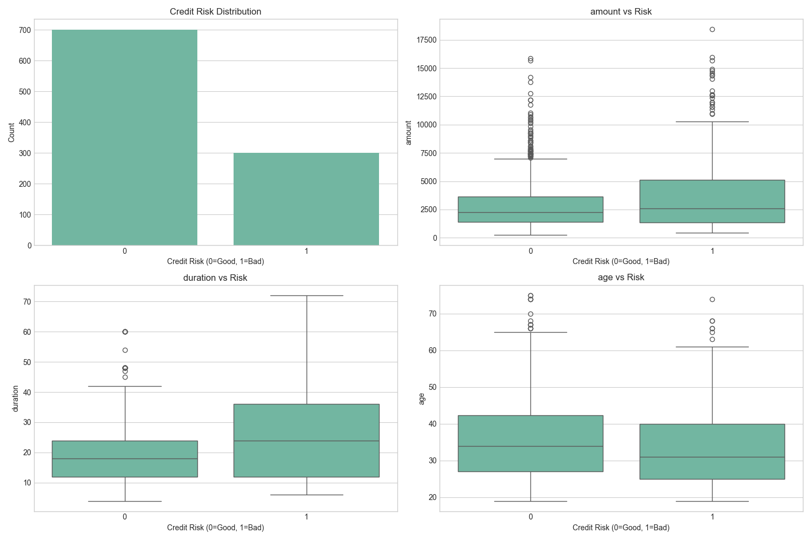
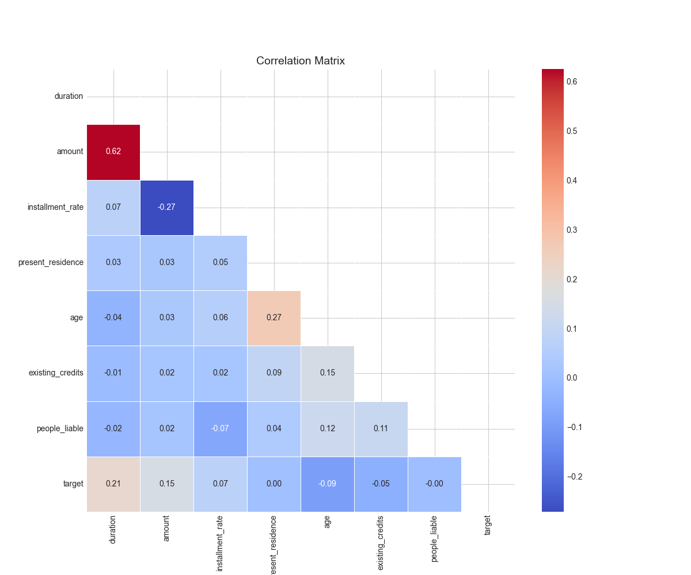
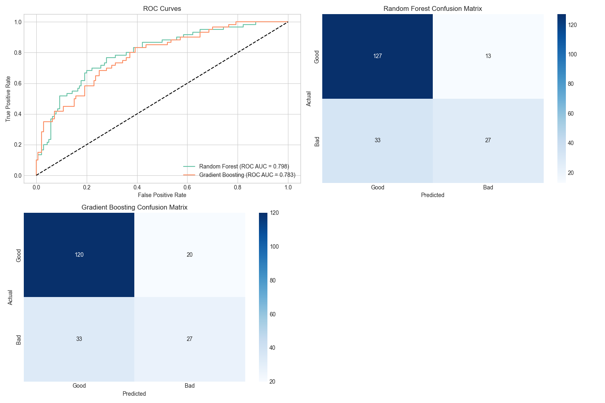

# German Credit Risk Prediction

## Overview

This project implements a comprehensive credit risk prediction system using the German Credit dataset. The system helps financial institutions assess the creditworthiness of loan applicants by predicting whether they represent good or bad credit risks.

## Features

- **Data Exploration & Visualization**: Comprehensive EDA with visualizations for understanding feature distributions and relationships
- **Model Training & Evaluation**: Implementation of Random Forest and Gradient Boosting models with hyperparameter optimization
- **Interactive Web Interface**: Streamlit application for exploring data, comparing models, and making predictions
- **Business Insights**: Business value analysis including cost-benefit calculations and ROI estimation
- **Feature Importance Analysis**: Identification of key risk factors for credit decision-making

## Screenshots

### Exploratory Data Analysis

*Analysis of credit risk distribution and key feature relationships*

### Correlation Matrix

*Correlation between numerical features in the dataset*

### Model Performance

*ROC curves and confusion matrices for trained models*

## Installation

```bash
# Clone the repository
git clone https://github.com/yourusername/german-credit-risk.git
cd german-credit-risk

# Create and activate virtual environment (optional but recommended)
python -m venv venv
source venv/bin/activate  # On Windows: venv\Scripts\activate

# Install required packages
pip install -r requirements.txt

# Download the dataset (if not already included)
# Dataset available at: https://archive.ics.uci.edu/ml/datasets/statlog+(german+credit+data)
```

## Usage

### Running the Streamlit Web Application

```bash
streamlit run app.py
```

This will start the web server and open the application in your default browser.

### Running the Analysis Script

```bash
python credit_risk.py
```

This will execute the full machine learning pipeline and generate analysis results and visualizations.

## Project Structure

```
german-credit-risk/
│
├── app.py                  # Streamlit web application
├── credit_risk.py          # Machine learning pipeline
├── requirements.txt        # Required Python packages
├── german_credit_data.csv  # Dataset (if included)
├── german.data             # Alternative dataset format
│
├── images/                 # Generated visualizations
│   ├── credit_risk_eda.png
│   ├── correlation_matrix.png
│   ├── model_results.png
│   └── feature_importance.png
│
└── README.md               # Project documentation
```

## Machine Learning Approach

The system implements a comprehensive approach to credit risk prediction:

1. **Data Preprocessing**:
   - Missing value imputation
   - Feature scaling
   - One-hot encoding for categorical variables

2. **Model Training**:
   - Random Forest Classifier
   - Gradient Boosting Classifier
   - Hyperparameter tuning via grid search
   - Cross-validation for robust evaluation

3. **Evaluation Metrics**:
   - ROC AUC (primary metric)
   - Precision, Recall, F1-score
   - Confusion matrix analysis

## Business Insights

The analysis provides several key insights:

- **Credit History Impact**: Past credit behavior is a strong predictor of future default risk
- **Duration and Amount**: Longer loan terms with higher amounts significantly increase risk
- **Savings Buffer**: Applicants with substantial savings demonstrate lower default rates
- **Employment Stability**: Longer employment duration correlates with better repayment
- **Age Correlation**: Age shows a moderate correlation with credit risk

## Application Interface

The Streamlit application includes four main sections:

1. **Overview & Data**: Dataset exploration and basic statistics
2. **Model Performance**: Comparison of model metrics and visualization of results
3. **Prediction Tool**: Interactive form for predicting credit risk of new applicants
4. **Business Insights**: Analysis of business impact and ROI estimation

## Requirements

- Python 3.8+
- Streamlit
- Pandas
- NumPy
- Scikit-learn
- Matplotlib
- Seaborn

See `requirements.txt` for complete dependencies.

## Future Work

- Integration with additional datasets for more comprehensive risk assessment
- Implementation of more advanced models (XGBoost, Neural Networks)
- Development of a monitoring system for model performance
- Addition of explainability tools like SHAP values
- API endpoints for integration with other systems

## License

This project is licensed under the MIT License - see the LICENSE file for details.

## Acknowledgments

- UCI Machine Learning Repository for the German Credit dataset
- Streamlit for the interactive web application framework
- The scikit-learn team for machine learning tools
